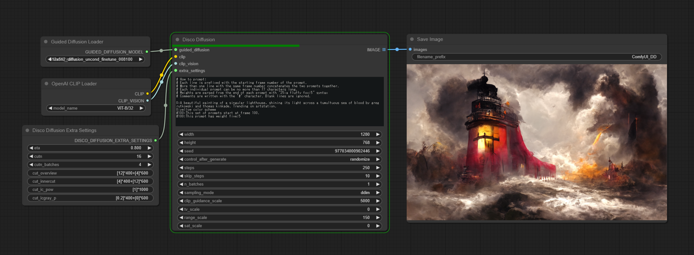

# Disco Diffusion for ComfyUI

This repo holds a modularized version of [Disco Diffusion](https://github.com/alembics/disco-diffusion) for use with [ComfyUI](https://github.com/comfyanonymous/ComfyUI).



## Installation

1. Clone this repository into your `ComfyUI/custom_nodes` folder with `git clone --recursive https://github.com/space-nuko/ComfyUI-Disco-Diffusion`.
2. Activate the virtualenv you use with ComfyUI.
3. Navigate to the cloned folder and run `pip install -r requirements.txt`.

**NOTE:** You also have to make sure that inference mode is turned off within ComfyUI or you'll get errors.

In `ComfyUI/execution.py`, change:

``` python
with torch.inference_mode():
```

to:
``` python
with torch.inference_mode(False):
```

## Nodes included

- **Guided Diffusion Loader** - Loads a Guided Diffusion model checkpoint. All models are automatically downloaded to your `ComfyUI/models/Disco-Diffusion` folder.
- **OpenAI CLIP Loader** - Loads the OpenAI/OpenCLIP format CLIP models. All models are automatically downloaded and cached. You can also use ComfyUI's built-in CLIP loader nodes. The recommended model for use with the built-in nodes is `clip-vit-large-patch14`, found [here](https://huggingface.co/openai/clip-vit-large-patch14/blob/main/pytorch_model.bin).
- **Disco Diffusion** - The main sampler node.
- **Disco Diffusion Extra Settings** - Optional settings you can pass into the Disco Diffusion node.

## Usage

The simplest usage is to connect the Guided Diffusion Loader and OpenAI CLIP Loader nodes into a Disco Diffusion node, then hook the Disco Diffusion node up to a Save Image node.

Alternatively, you can substitute the OpenAI CLIP Loader for ComfyUI's CLIP Loader and CLIP Vision Loader, however in this case you need to copy the CLIP model you use into both the `clip` and `clip_vision` subfolders under your `ComfyUI/models` folder, because ComfyUI can't load both at once from the same model file.

The Disco Diffusion node uses a special syntax for writing prompts, which is shown below.

```
; You can write comments like this.

0:A beautiful painting of a singular lighthouse, shining its light across a tumultuous sea of blood by greg rutkowski and thomas kinkade. Trending on artstation.
0:yellow color scheme
100:This set of prompts start at frame 100.
100:This prompt has weight five:5
```

The leading number in front of each prompt indicates which step number in the generation the prompt should begin being used on. More than one prompt with the same number is concatenated into a list, ordered from top to bottom. This lets you write prompts that are longer than 77 tokens total, as that is the maximum context length that CLIP is capable of. (By contrast, stable-diffusion-webui automatically splits up longer prompts for you)

The trailing number at the end of each prompt is optional and controls the weight of the prompt. You can also have negative weights, but **the sum of all weights cannot equal 0.**

Read the [Disco Diffusion Cheatsheet](https://botbox.dev/disco-diffusion-cheatsheet/) for more information about the parameters available.
